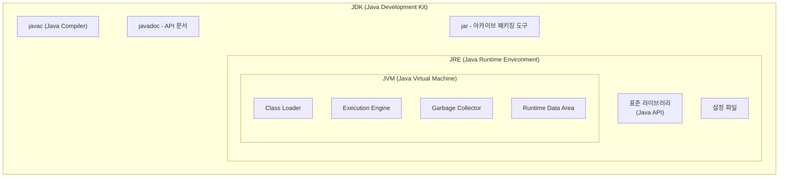

### JDK, JVM, JRE, javac

| name  | full-name                | explain                                                                                            |
|-------|--------------------------|----------------------------------------------------------------------------------------------------|
| JDK   | Java Development Kit     | 자바 개발을 위한 도구 (JRE, javac 포함)                                                                       | 
| JRE   | Java Runtime Environment | 자바 실행 환경으로 JVM과 표준 라이브러리, 설정 파일 등을 포함                                                              |
| JVM   | Java Virtual Machine  | class(바이트코드) 파일을 읽어 실행하는 엔진 (Class Loader, Runtime Data Area, Execution Engine, Garbage Collector) | 
| javac | Java Complier | 자바(java)를 바이트코드 (class)로 변환하는 도구                                                                   | 

* Java 11 부터 JRE는 없어지고, JDK로 통합되었다.


### JVM Memory Area (Runtime Data Area)
| name | thread scope | Contents                                   | explain               | 
| -- |--------------|--------------------------------------------| --- |
| Method Area | all          | 클래스 메타데이터, static 변수, 상수, JIT 캐싱           |
| Heap | all          | 인스턴스 변수                                    | Garbage Collector가 관리 | 
| Stack | thread       | 지역변수, 매개변수, 참조주소값, 메서드 호출 정보 (Stack Frame) |  LIFO 구조 |
| PC Register | thread       | 현재 실행 중인 JVM 명령어 주소, 다음에 실행할 명령어 위치        | 스레드가 어디를 실행해야 하는지 추적 | 
| Native Method Stack | thread       | Native 메소드, JNI 호출정보                       | Java가 아닌 다른 언어 | 

* 인스턴스 변수(Instance Variable): 클래스 내부에서 선언되지만, 메소드 바깥에 위치하는 변수
* 객체 인스턴스(Collection, 배열, String ...) 의 주소값은 Stack에, 실제 값은 Heap에 저장된다.
* 스프링 ThreadLocal은 Heap에 저장된다. 각 Thread가 독립적인 Map을 가지고 있어 스레드 안정성이 보장된다.  

### Exception
```
Throwable (최상위)
├── Error (시스템 레벨 오류)
│   ├── OutOfMemoryError
│   ├── StackOverflowError
│   └── VirtualMachineError
│
└── Exception (프로그램 레벨 예외)
    ├── RuntimeException (Unchecked Exception)
    │   ├── NullPointerException
    │   ├── IndexOutOfBoundsException
    │   └── IllegalArgumentException
    │
    └── Checked Exception
        ├── IOException
        ├── SQLException
        └── ClassNotFoundException
```
| 구분 | Error | CheckedException | UncheckedException |
|-- | -- | --| --| 
| 상위클래스 | Throwable | Exception | RuntimeException |
| 처리 강제 | X | ✅| X |
| 복구 가능 | X | ✅| ✅|
| 발생 시점 | 런타임 | 컴파일/런타임 | 런타임 |
| 원인 | 시스템 자원 | 외부 요인 | 프로그래밍 실수 |

> 스프링에서 CheckedException이 발생하면, 롤백되지 않는다. 비즈니스 적인 예외로 판단하기 때문에 (다른 흐름으로 처리해야 한다고 본다), 커밋한다.
> CheckedException을 사용하면 try-catch문을 써야하고, 실제 업무에선 예외가 발생하면 롤백해야 하는 경우가 대부분이다. 최근에는 CheckedException을 지양하는 추세다


