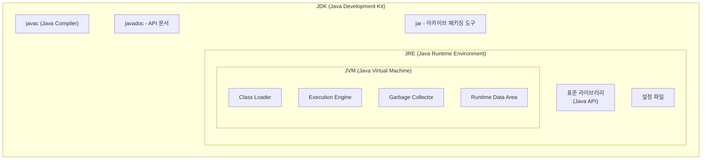

### JDK, JVM, JRE, javac

| name  | full-name                | explain                                                                                            |
|-------|--------------------------|----------------------------------------------------------------------------------------------------|
| JDK   | Java Development Kit     | 자바 개발을 위한 도구 (JRE, javac 포함)                                                                       | 
| JRE   | Java Runtime Environment | 자바 실행 환경으로 JVM과 표준 라이브러리, 설정 파일 등을 포함                                                              |
| JVM   | Java Virtual Machine  | class(바이트코드) 파일을 읽어 실행하는 엔진 (Class Loader, Runtime Data Area, Execution Engine, Garbage Collector) | 
| javac | Java Complier | 자바(java)를 바이트코드 (class)로 변환하는 도구                                                                   | 

* Java 11 부터 JRE는 없어지고, JDK로 통합되었다.


### JVM Memory Area (Runtime Data Area)
| name | thread scope | Contents                                   | explain               | 
| -- |--------------|--------------------------------------------| --- |
| Method Area | all          | 클래스 메타데이터, static 변수, 상수, JIT 캐싱           |
| Heap | all          | 인스턴스 변수                                    | Garbage Collector가 관리 | 
| Stack | thread       | 지역변수, 매개변수, 참조주소값, 메서드 호출 정보 (Stack Frame) |  LIFO 구조 |
| PC Register | thread       | 현재 실행 중인 JVM 명령어 주소, 다음에 실행할 명령어 위치        | 스레드가 어디를 실행해야 하는지 추적 | 
| Native Method Stack | thread       | Native 메소드, JNI 호출정보                       | Java가 아닌 다른 언어 | 

* 인스턴스 변수(Instance Variable): 클래스 내부에서 선언되지만, 메소드 바깥에 위치하는 변수
* 객체 인스턴스(Collection, 배열, String ...) 의 주소값은 Stack에, 실제 값은 Heap에 저장된다.
* 스프링 ThreadLocal은 Heap에 저장된다. 각 Thread가 독립적인 Map을 가지고 있어 스레드 안정성이 보장된다.  

### Exception
```
Throwable (최상위)
├── Error (시스템 레벨 오류)
│   ├── OutOfMemoryError
│   ├── StackOverflowError
│   └── VirtualMachineError
│
└── Exception (프로그램 레벨 예외)
    ├── RuntimeException (Unchecked Exception)
    │   ├── NullPointerException
    │   ├── IndexOutOfBoundsException
    │   └── IllegalArgumentException
    │
    └── Checked Exception
        ├── IOException
        ├── SQLException
        └── ClassNotFoundException
```
| 구분 | Error | CheckedException | UncheckedException |
|-- | -- | --| --| 
| 상위클래스 | Throwable | Exception | RuntimeException |
| 처리 강제 | X | ✅| X |
| 복구 가능 | X | ✅| ✅|
| 발생 시점 | 런타임 | 컴파일/런타임 | 런타임 |
| 원인 | 시스템 자원 | 외부 요인 | 프로그래밍 실수 |

> 스프링에서 CheckedException이 발생하면, 롤백되지 않는다. 비즈니스 적인 예외로 판단하기 때문에 (다른 흐름으로 처리해야 한다고 본다), 커밋한다.
> CheckedException을 사용하면 try-catch문을 써야하고, 실제 업무에선 예외가 발생하면 롤백해야 하는 경우가 대부분이다. 최근에는 CheckedException을 지양하는 추세다

### finalize 와 try-with-resource
#### finalize()
1. GC에 의해 메모리에서 제거되기 직전에 호출되는 callback method다 
2. 객체가 사용하고 있는 자원(파일IO등)을 해제하기 위해 사용되었지만, 아래 사유로 java 9부터 deprecated 되었다. 
   1. 실행 보장 없음: GC가 언제 동작할지 알 수 없음
   2. 성능저하: 메모리 회수 속도 저하 (finalize가 정의된 객체는 즉시 삭제 안되고, Finalizer Queue라는 대기열에 저장된다. 별도 스레드에서 큐의 작업을 하나씩 실행한다. 다음 GC 사이클이 동작할 때 finalize()까지 실행되었는지를 판단하고 삭제한다.)
   3. 예외 발생 위험: finalize()에서 예외가 발생하면 JVM은 예외를 무시한다. (자원이 닫히지 않을 수 있다.) finalize()에서 자기를 static 변수에 할당해버리면, 객체가 수거되지 않는다. (좀비) 
#### try-with-resouce
java7부터 도입된 기능으로, try 구문을 벗어나면 자동으로 close() 메소드가 호출되어 자원이 닫힌다. 
`try-catch-finally` 구문을 사용하면, finally에서 닫아주어야 했고, 다른 오류가 발생하면 조치할 수 없었지만, `try-with-resouce`에서는 exception이 발생하면 close()를 무조건 호출하고 catch영역이 실행된다. 
AutoCloseable를 구현해야 한다. 
```java
try (FileOutputStream fos = new FileOutputStream("test.txt")) {
    // 작업 수행 (따로 close()를 호출할 필요가 없음!)
} catch (IOException e) {
    e.printStackTrace();
}
```
### java의 참조 타입
#### Strong Reference
참조변수가 활성되어있는 경우
```java
public static void main(String[] args) {
    Object obj = new Object();
    System.gc(); 
    System.out.println("object = "+object); // gc로 수거되지 않음.
}
```
#### Soft Reference
java.lang.ref.SoftReference를 이용해 구현한다. JVM 메모리가 부족하면 지워지기 때문에, 캐시 기능으로 사용된다.
(실제 업무에선 `Ehcache`, `Caffeine` 등의 로컬 캐시 라이브러리를 쓰지.. )
```java 
import java.lang.ref.SoftReference;

public static void main(String[] args) {
   Object obj = new Object();
   SoftReference<Object> softReference = new SoftReference<>(obj);
   obj = null; // 참조 해제
   System.gc();
   System.out.println("object = " + softReference.get()); // 객체 출력됨.
}
```
#### Weak Reference
java.lang.ref.WeakReference를 이용해 구현한다. GC가 동작하면 즉시 삭제된다.
```java
import java.lang.ref.WeakReference;

public static void main(String[] args) {
   Object obj = new Object();
   WeakReference<Object> weakReference = new WeakReference<>(obj);
   obj = null; // 참조 해제
   System.gc();
   System.out.println("object = "+weakReference.get()); // null 출력됨.
}
```
#### Phantom Reference
객체가 메모리에서 완전히 삭제되기 직전에 알림을 받아 후처리 작업을 할 때만 사용합니다.
```java
public static void main(String[] args) {
        Object obj = new Object();
        ReferenceQueue<Object> queue = new ReferenceQueue<>();
        
        // 팬텀 참조는 반드시 ReferenceQueue와 함께 사용해야 함
        PhantomReference<Object> phantomRef = new PhantomReference<>(obj, queue);
        
        System.out.println("Phantom get(): " + phantomRef.get()); // 항상 null

        obj = null;
        System.gc();
        
        // 객체가 수거되면 큐에 참조 정보가 들어감
        if (queue.poll() != null) {
            System.out.println("객체가 삭제됨을 감지하여 후처리 작업을 진행합니다.");
        }
    }
```
### Collection, Collections, Map
| 구분 | Collection | Map | Collections |
| -- | -- | -- | --|
| 정체| interface | interface | Utility |
| 형태 | 집합 | Key-Value | |
| Sub Class| ArrayList, HashSet, Stack, PriorityQueue| HashMap, TreeMap | |
> Iterable > Collection > List > ArrayList, LinkedList 

> HashSet은 내부적으로 HashMap으로 구현되어 있다. HashMap의 Key의 중복 방지 기능을 활용한다.

### Stream 
1. java 8부터 도입되었다. 
2. 명령형 방식으로 코드가 직관적이며,  지연연산과 단축(Short-Circuit)으로 JVM이 자동으로 동작을 최적화 해준다. 
3. 스트림 생성 > 중간연산 > 최종연산 순서로 동작한다. 
4. 병렬 처리를 지원한다. 
   1. Fork-Join 방식으로 동작한다.  Steam을 나눠(Fork) 병렬로 실행한 후 합친다(Join).
   2. JVM 공용 스레드 풀을 사용하기 때문에, CPU 코어 갯수 만큼 병렬로 실행한다. (공용 스레드 풀이기 때문에서, 어디선가 스레드풀을 점유하고 있으면 병목이 발생할 수 있다.) 

