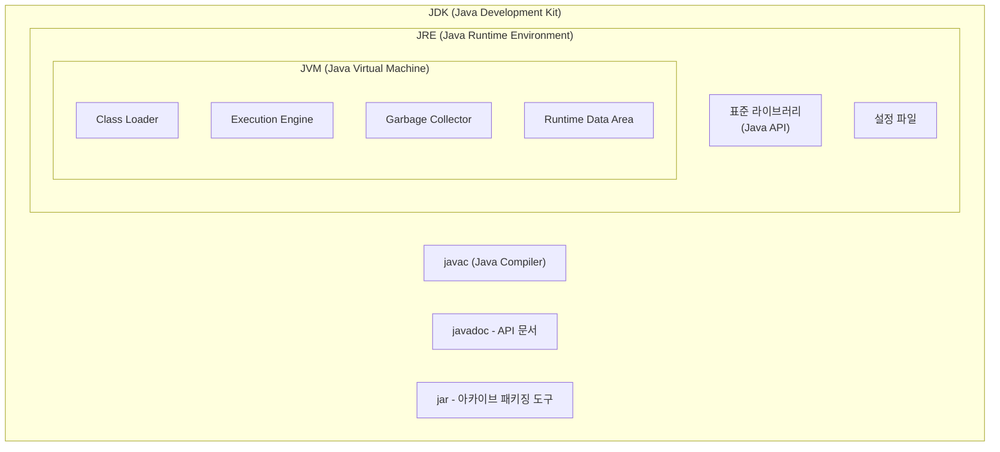

### JDK, JVM, JRE, javac

| name  | full-name                | explain                                                                                            |
|-------|--------------------------|----------------------------------------------------------------------------------------------------|
| JDK   | Java Development Kit     | 자바 개발을 위한 도구 (JRE, javac 포함)                                                                       | 
| JRE   | Java Runtime Environment | 자바 실행 환경으로 JVM과 표준 라이브러리, 설정 파일 등을 포함                                                              |
| JVM   | Java Virtual Machine  | class(바이트코드) 파일을 읽어 실행하는 엔진 (Class Loader, Runtime Data Area, Execution Engine, Garbage Collector) | 
| javac | Java Complier | 자바(java)를 바이트코드 (class)로 변환하는 도구                                                                   | 

* Java 11 부터 JRE는 없어지고, JDK로 통합되었다. 
* 

